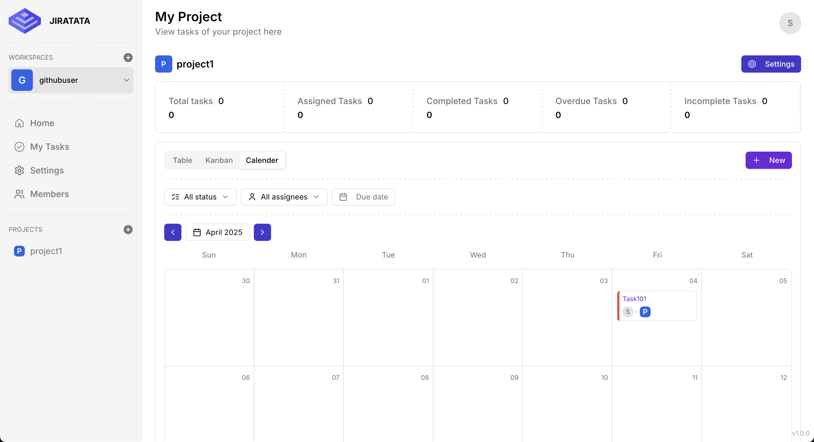
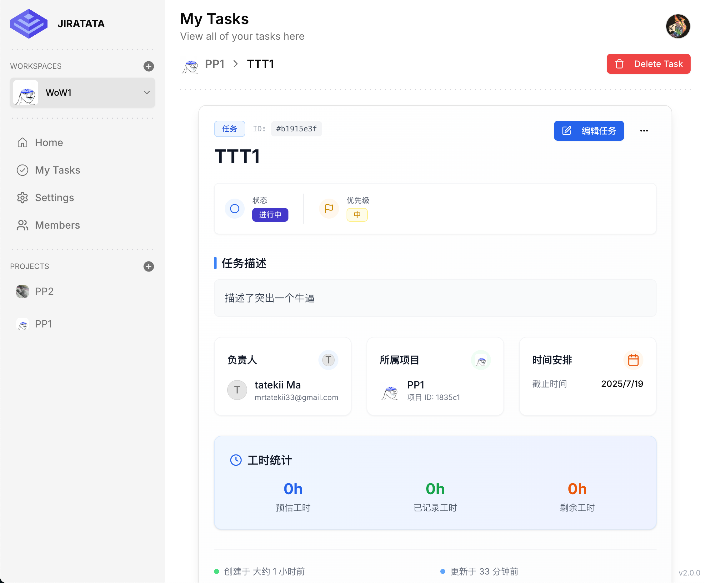

# 非常magic的jira clone

> Current branch is WIP👷




## Features

### 🔐 Authentication
- **传统邮箱密码登录**：支持用户名邮箱注册和登录
- **OAuth登录**：支持GitHub和Google第三方登录
- **JWT令牌认证**：基于JWT的无状态认证系统
- **会话管理**：支持多设备登录和会话管理
- **邮箱验证**：OAuth用户自动验证，传统用户可后续验证

### 🏢 Workspace Management
- 创建和管理工作区
- 邀请码加入工作区
- 成员角色管理（管理员/成员/访客）

### 📋 Project & Task Management
- 项目创建和管理
- 任务的创建、分配和状态管理
- 看板视图和列表视图
- 任务拖拽排序

### 📁 File Management
- 文件上传和管理
- 支持多种文件格式
- GridFS文件存储

## Client
- `Next`

## Server
- `Hono`

## Database

### 🟥`appwrite`

#### user
| Attr | Type | Required | Desc |
| :----:| :----: | :----: | :----: |
| $id | string | Y | 自动创建id |

#### workspaces
| Attr | Type | Required | Desc |
| :----:| :----: | :----: | :----: |
| name | string | Y | 工作区名 |
| userId | string | Y | 用户id($id) |
| imageUrl | string |  | 工作区图标 |
| inviteCode | string | Y | 邀请码 |
| $id | string | Y | 自动创建id |

#### members
| Attr | Type | Required | Desc |
| :----:| :----: | :----: | :----: |
| userId | string | Y | 用户id($id) |
| workspaceId | string | Y | 工作区id($id) |
| role | emum | Y | 成员角色 |
| $id | string | Y | 自动创建id |

#### projects
| Attr | Type | Required | Desc |
| :----:| :----: | :----: | :----: |
| name | string | Y | 名称 |
| workspaceId | string | Y | 工作区id($id) |
| imageUrl | string |  | 项目图标 |
| $id | string | Y | 自动创建id |

#### tasks
| Attr | Type | Required | Desc |
| :----:| :----: | :----: | :----: |
| name | string | Y | 名称 |
| description | string |  | 描述 |
| workspaceId | string | Y | 工作区id($id) |
| projectId | string | Y | 项目id($id) |
| dueDate | Datetime | Y | 到期时间 |
| assigneeId | string | Y | 负责人id($id) |
| status | enum | Y | BACKLOG/TODO/DONE/IN_REVIEW/IN_PROGRESS |
| position | integer | Y |  |
| $id | string | Y | 自动创建id |


### 🟩mongoDB`

#### users
| Attr | Type | Required | Desc |
| :----:| :----: | :----: | :----: |
| name | string | Y | 用户名 |
| email | string | Y | 邮箱地址（唯一） |
| password | string | * | 密码（加密存储，默认不返回）注：OAuth用户可能没有密码 |
| oauthAccounts | Array |  | OAuth账户信息数组 |
| avatar | string |  | 用户头像URL |
| isEmailVerified | boolean | Y | 邮箱是否已验证（默认false） |
| createdAt | Date | Y | 创建时间（自动） |
| updatedAt | Date | Y | 更新时间（自动） |
| _id | ObjectId | Y | MongoDB自动生成ID |

##### OAuth账户信息结构
| Attr | Type | Required | Desc |
| :----:| :----: | :----: | :----: |
| provider | enum | Y | OAuth提供商（google/github） |
| providerId | string | Y | 提供商用户ID |
| email | string |  | OAuth提供商邮箱 |
| name | string |  | OAuth提供商用户名 |
| avatar | string |  | OAuth提供商头像URL |

#### workspaces
| Attr | Type | Required | Desc |
| :----:| :----: | :----: | :----: |
| name | string | Y | 工作区名称 |
| userId | ObjectId | Y | 创建者用户ID（ref: User） |
| imageUrl | string |  | 工作区图标URL |
| inviteCode | string | Y | 邀请码（唯一） |
| createdAt | Date | Y | 创建时间（自动） |
| updatedAt | Date | Y | 更新时间（自动） |
| _id | ObjectId | Y | MongoDB自动生成ID |

#### members
| Attr | Type | Required | Desc |
| :----:| :----: | :----: | :----: |
| userId | ObjectId | Y | 用户ID（ref: User） |
| workspaceId | ObjectId | Y | 工作区ID（ref: Workspace） |
| role | enum | Y | 成员角色（ADMIN/MEMBER/GUEST） |
| createdAt | Date | Y | 创建时间（自动） |
| updatedAt | Date | Y | 更新时间（自动） |
| _id | ObjectId | Y | MongoDB自动生成ID |

#### projects
| Attr | Type | Required | Desc |
| :----:| :----: | :----: | :----: |
| name | string | Y | 项目名称 |
| workspaceId | ObjectId | Y | 工作区ID（ref: Workspace） |
| imageUrl | string |  | 项目图标URL |
| createdAt | Date | Y | 创建时间（自动） |
| updatedAt | Date | Y | 更新时间（自动） |
| _id | ObjectId | Y | MongoDB自动生成ID |

#### tasks
| Attr | Type | Required | Desc |
| :----:| :----: | :----: | :----: |
| name | string | Y | 任务名称 |
| description | string |  | 任务描述 |
| workspaceId | ObjectId | Y | 工作区ID（ref: Workspace） |
| projectId | ObjectId | Y | 项目ID（ref: Project） |
| dueDate | Date | Y | 截止日期 |
| assigneeId | ObjectId | Y | 负责人ID（ref: Member） |
| status | enum | Y | 任务状态（BACKLOG/TODO/IN_PROGRESS/IN_REVIEW/DONE） |
| position | number | Y | 任务位置（排序用） |
| createdAt | Date | Y | 创建时间（自动） |
| updatedAt | Date | Y | 更新时间（自动） |
| _id | ObjectId | Y | MongoDB自动生成ID |

#### tokens
| Attr | Type | Required | Desc |
| :----:| :----: | :----: | :----: |
| userId | ObjectId | Y | 用户ID（ref: User） |
| type | enum | Y | Token类型（access/refresh/email_verification/password_reset/magic_link） |
| status | enum | Y | Token状态（active/revoked/expired/used） |
| jti | string | Y | JWT唯一标识符 |
| tokenHash | string | Y | Token哈希值 |
| expiresAt | Date | Y | 过期时间 |
| sessionId | string |  | 会话ID |
| ipAddress | string |  | IP地址 |
| userAgent | string |  | 用户代理 |
| deviceInfo | object |  | 设备信息（device/os/browser） |
| revokedAt | Date |  | 撤销时间 |
| revokedBy | ObjectId |  | 撤销者ID |
| revokedReason | string |  | 撤销原因 |
| lastUsedAt | Date |  | 最后使用时间 |
| parentTokenId | ObjectId |  | 父Token ID |
| createdAt | Date | Y | 创建时间（自动） |
| updatedAt | Date | Y | 更新时间（自动） |
| _id | ObjectId | Y | MongoDB自动生成ID |

#### files
| Attr | Type | Required | Desc |
| :----:| :----: | :----: | :----: |
| filename | string | Y | 文件名 |
| contentType | string | Y | 文件MIME类型 |
| size | number | Y | 文件大小（字节） |
| data | Buffer | Y | 文件数据 |
| uploadDate | Date | Y | 上传时间 |
| _id | ObjectId | Y | MongoDB自动生成ID |


## TODO
1. 自定义task状态
2. 实现文件上传的GridFS支持（替代当前的Buffer存储）
3. 添加数据库连接池优化
4. 实现Token自动清理的定时任务
5. 添加数据库迁移脚本
6. 优化查询性能（添加更多复合索引）
7. 实现软删除功能
8. 添加数据备份策略
9. 优化OAuth错误处理和用户体验
10. 添加OAuth账户绑定/解绑功能
11. 实现邮箱验证功能
12. 添加用户个人资料管理

## OAuth Setup

本应用支持GitHub和Google OAuth登录。要配置OAuth功能，请参考 [OAuth配置指南](./OAUTH_SETUP_GUIDE.md)。

### 快速配置步骤：

1. **GitHub OAuth**：
   - 访问 [GitHub Developer Settings](https://github.com/settings/developers)
   - 创建新的OAuth应用
   - 设置回调URL：`http://localhost:3000/api/auth/oauth/github/callback`

2. **Google OAuth**：
   - 访问 [Google Cloud Console](https://console.cloud.google.com/)
   - 创建OAuth 2.0客户端ID
   - 设置重定向URI：`http://localhost:3000/api/auth/oauth/google/callback`

3. **环境变量配置**：
   ```bash
   GITHUB_CLIENT_ID=your_github_client_id
   GITHUB_CLIENT_SECRET=your_github_client_secret
   GOOGLE_CLIENT_ID=your_google_client_id
   GOOGLE_CLIENT_SECRET=your_google_client_secret
   NEXTAUTH_SECRET=your_nextauth_secret
   ```

详细配置说明请查看 [OAUTH_SETUP_GUIDE.md](./OAUTH_SETUP_GUIDE.md)